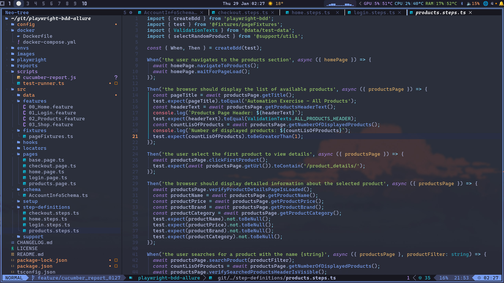
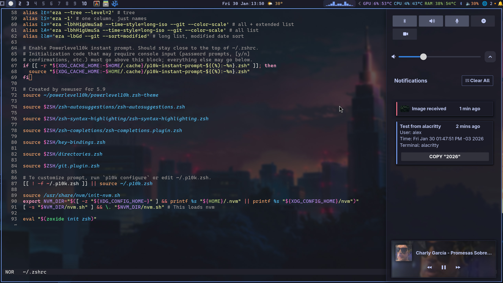
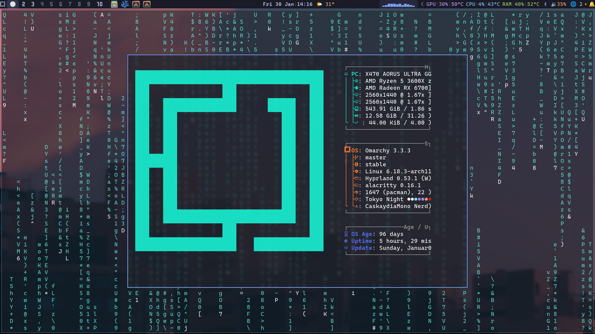

# Dotfiles 📁

My personal dotfiles for Linux configuration. 🐧

## About Omarchy 🐧

These dotfiles are configured for [Omarchy](https://omarchy.org/), a Linux distribution.
- **Homepage**: https://omarchy.org/
- **GitHub**: https://github.com/basecamp/omarchy

## Media 🎥

### Video Demo

https://github.com/user-attachments/assets/aebfe9c4-24d4-4125-ab3a-b4607d159b8d

### Screenshots


<div align="center">
<table>
  <tr>
    <td></td>
    <td></td>
  </tr>
  <tr>
    <td></td>
    <td></td>
  </tr>
</table>
</div>

## Included Configurations ⚙️

### Window Manager / Desktop 🖥️
- 🪟 Hyprland (hypr/)
- 📊 Waybar (waybar/)
- 🔔 SwayNC (swaync/)

### Terminal 💻
- 🖥️ Alacritty (alacritty/)
- 🧩 Zellij (zellij/)
- 🐚 Zsh (.zsh, .zshrc, .p10k.zsh)

### Editors ✏️
- 📝 Helix (helix/)

### Media Player 🎬
- 🎵 MPV (mpv/)

### Utilities 🛠️
- ℹ️ FastFetch (fastfetch/)
- 🔊 CAVA (cava/)

## Installation 🛠️

These dotfiles are configured for Omarchy Linux and are meant to be symlinked to their respective locations.

### Quick setup script (optional) 🖥️

```bash
#!/bin/bash
# Symlink .config directories
for dir in alacritty cava fastfetch helix hypr mpv swaync waybar zellij; do
    ln -sfn ~/dotfiles/.config/$dir ~/.config/$dir
done

# Symlink home files
ln -sfn ~/dotfiles/home/.zsh ~/.zsh
ln -sfn ~/dotfiles/home/.zshrc ~/.zshrc
ln -sfn ~/dotfiles/home/.p10k.zsh ~/.p10k.zsh
```

## Notes 📝

- This repository is personal and may contain custom configurations.
- These dotfiles are optimized for Omarchy Linux but may work on other distributions with adjustments.
- Feel free to fork and adapt to your own needs.

## License ⚖️

GNU General Public License v3.0
